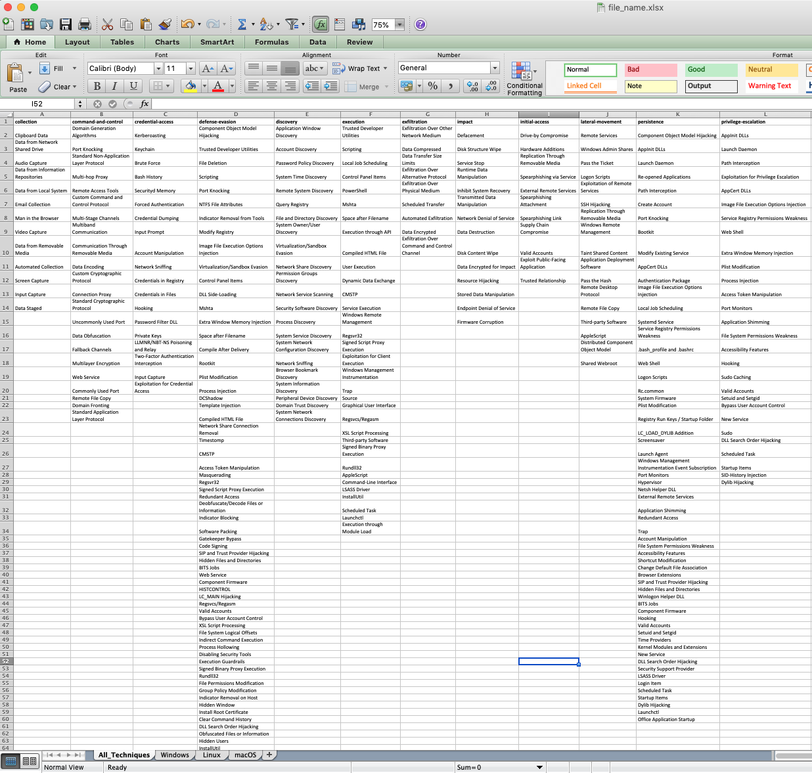

# Att&ck_TAXII_2_Excel_Matrix
A python3 script that takes in the Mitre TAXII feed and recreates the Enterprise Att&ck Navigator in Excel.  The different tabs in the spreadsheet it outputs, are seperated by platform, with one tab that has all the techniques combined.  

The script uses a list of lists that is generated based on the number categories present, then referenced by index when called.  This makes it a bit future proof as new content is added. 

Many thanks to the python community for all the online tutorials, whose code has been borrowed/modified to make this possible.

